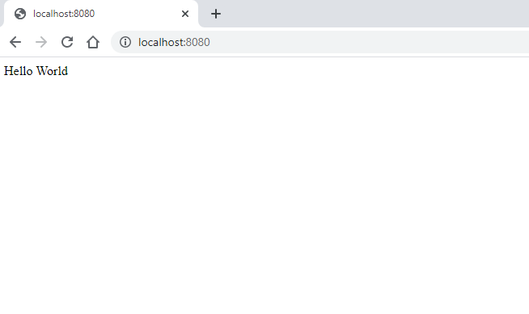

# Deploy a static web page helm and traefik

The purpose of this lab is to develop a full provisioned pipeline to deploy a static web page.

You can clone [this](https://github.com/rjrpaz/deploy-using-helm) repository to get some of the files that are we going to use during the lab.

## Objectives

1. Build your own Docker image that can serve a static "Hello World" HTML page

1. Deploy that image as a container in a Kubernetes cluster running locally on your machine using helm and writing your own chart

1. Deploy a Traefik container in the same local Kubernetes cluster using helm

1. Make Traefik an ingress point to access the "Hello World" page

1. Make the "Hello World" page accessible locally at [http://hello-world.local](http://hello-world.local)

## Requirements

For the purpose of this lab we are going to use a CentOS 7.

### Pre-requisite tools

We are going to use the following tools (click in the link to see how to install each tool):

- [Docker](./Docker.md)

- [Kubernetes](./Kubernetes.md)

- [Helm](./Helm.md)

## Deployment step by step

All required files and scripts for this deployment are stored here: [https://github.com/rjrpaz/deploy-using-helm](https://github.com/rjrpaz/deploy-using-helm)

I will use my docker user (rjrpaz) for tagging and uploading the image to the registry. I encourage you to replace this with your own user if you are trying to replicate these steps.

## Build your own Docker image that can serve a static "Hello World" HTML page

This image is created using a very simple *Dockerfile*.

1. Change to directory *deploy-using-helm*

    ```console
    cd deploy-using-helm/docker
    ```

    This is the content of Dockerfile:

    ```console
    [roberto@vmlab01 ]$ cat Dockerfile

    FROM nginx:1.21.1-alpine
    EXPOSE 80/tcp
    RUN echo "Hello World" > /usr/share/nginx/html/index.html
    ```

1. Build the docker image

    ```console
    docker build -t rjrpaz/tr-webapp:1.0.0 .
    ```

1. Run the container

    ```console
    docker run -p 8080:80 -d rjrpaz/tr-webapp:1.0.0
    ```

    Access to the following url [http://localhost:8080](http://localhost:8080). You should see something like this:

    

1. Stop the container

    ```console
    docker stop $(docker ps -a -q  --filter ancestor=rjrpaz/tr-webapp:1.0.0)
    ```

1. Use *docker ps* to confirm the container is not running anymore.

1. Before pushing this images to Docker hub, we have to login first:

    ```console
    [roberto@vmlab01 ]$ docker login
    Login with your Docker ID to push and pull images from Docker Hub. If you don't have a Docker ID, head over to https://hub.docker.com to create one.
    Username: rjrpaz
        ...
    Login Succeeded
    ```

1. Now we are allowed to push the image to the registry:

    ```console
    [roberto@vmlab01 ]$ docker push rjrpaz/tr-webapp:1.0.0
    The push refers to repository [docker.io/rjrpaz/tr-webapp]
    b2bad1512e02: Pushed
    45d993692050: Mounted from library/nginx
    1ea998b95474: Mounted from library/nginx
    95b99a5c3767: Mounted from library/nginx
    fc03e3cb8568: Mounted from library/nginx
    24934e5e6c61: Mounted from library/nginx
    e2eb06d8af82: Mounted from library/nginx
    1.0.0: digest: sha256:8979e04523669748441a58af0ea3547282ad7674133e7bd359b883da2cb4a7d0 size: 1775
    [roberto@vmlab01 ]$
    ```

1. We can also upload the same image using the "latest" tag:

    ```console
    docker tag rjrpaz/tr-webapp:1.0.0 rjrpaz/tr-webapp:latest
    ```

    ```console
    docker push rjrpaz/tr-webapp:latest
    ```

## Deploy docker image as a container in a local Kubernetes cluster using helm

To running this we are going to use an isolated namespace (*tr-webapp-ns*) in the cluster.

1. Create the cluster namespace

    ```console
    kubectl create namespace tr-webapp-ns
    ```

1. Create the helm char skeleton

    ```console
    helm create tr-webapp
    ```

1. Modify repository in file *tr-webapp/values.yaml*. Replace:

    ```console
    repository: nginx
    ```

    with:

    ```console
    repository: rjrpaz/tr-webapp
    ```

1. Modify tag in file *tr-webapp/values.yaml*. Replace:

    ```console
    tag: ""
    ```

    with:

    ```console
    tag: "1.0.0"
    ```

1. Check helm chart integrity:

    ```console
    [roberto@vmlab01 ]$ helm lint ./tr-webapp
    ==> Linting ./tr-webapp
    [INFO] Chart.yaml: icon is recommended

    1 chart(s) linted, 0 chart(s) failed
    ```

1. Install the image using this new chart:

    ```console
    [roberto@vmlab01 ]$ helm install tr-webapp ./tr-webapp --namespace tr-webapp-ns
    NAME: tr-webapp
    LAST DEPLOYED: Thu Sep  9 15:30:23 2021
    NAMESPACE: tr-webapp-ns
    STATUS: deployed
    REVISION: 1
    NOTES:
    1. Get the application URL by running these commands:
    export POD_NAME=$(kubectl get pods --namespace tr-webapp-ns -l "app.kubernetes.io/name=tr-webapp,app.kubernetes.io/instance=tr-webapp" -o jsonpath="{.items[0].metadata.name}")
    export CONTAINER_PORT=$(kubectl get pod --namespace tr-webapp-ns $POD_NAME -o jsonpath="{.spec.containers[0].ports[0].containerPort}")
    echo "Visit http://127.0.0.1:8080 to use your application"
    kubectl --namespace tr-webapp-ns port-forward $POD_NAME 8080:$CONTAINER_PORT
    ```

1. To test this image, we should run the command provided by previous step:

    ```console
    export POD_NAME=$(kubectl get pods --namespace tr-webapp-ns -l "app.kubernetes.io/name=tr-webapp,app.kubernetes.io/instance=tr-webapp" -o jsonpath="{.items[0].metadata.name}")
    export CONTAINER_PORT=$(kubectl get pod --namespace tr-webapp-ns $POD_NAME -o jsonpath="{.spec.containers[0].ports[0].containerPort}")
    kubectl --namespace tr-webapp-ns port-forward $POD_NAME 8080:$CONTAINER_PORT
    ```

1. Access to the same url [http://localhost:8080](http://localhost:8080) and you should see the same sample webpage as before:

    ```console
    [roberto@vmlab01 ~]$ curl http://127.0.0.1:8080
    Hello World
    ```

1. Press <kbd>Ctrl + C</kbd> to interrupt the port forwarding

## Deploy a Traefik container in the same local Kubernetes cluster using helm

For this step we are going to use a public helm repos.

1. Add helm repo for *traefik*

    ```console
    helm repo add traefik https://helm.traefik.io/traefik
    ```

1. Update helm

    ```console
    helm repo update
    ```

1. Install traefik

    ```console
    helm install traefik-ingress-service traefik/traefik --namespace tr-webapp-ns
    ```

1. List pods in the namespace to check status

    ```console
    [roberto@vmlab01 ]$ kubectl get pods --namespace tr-webapp-ns
    NAME                         READY   STATUS    RESTARTS   AGE
    tr-webapp-7fd9455889-qqmql   1/1     Running   0          13m
    traefik-7499c455c-spr8b      1/1     Running   0          22s
    ```

## Make Traefik an ingress point to access the "Hello World" page

Alternative solution using nginx ingress [here](./Nginx_ingress.md)

Alternative using traefik + yaml files [here](./Traefik-yaml.md)

References:

- [https://minikube.sigs.k8s.io/docs/handbook/accessing/](https://minikube.sigs.k8s.io/docs/handbook/accessing/)

## TODO

- Make ingress to work with newest version of minikube (1.23.0)

- Configuring all services using a custom helm chart (remove yaml content).

- Add scripts to run these steps
