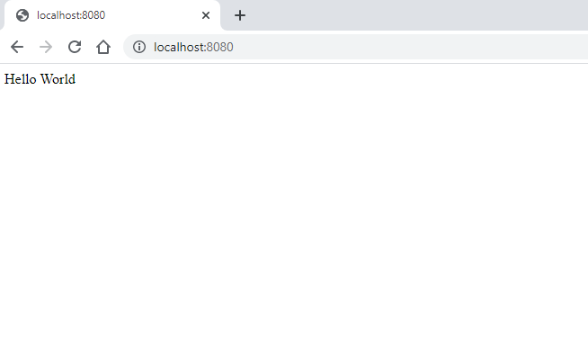

# Deploy a docker image for the app

I will use my docker user (rjrpaz) for tagging and uploading the image to the registry. I encourage you to replace this with your own user if you are trying to replicate these steps.

This image is created using a very simple *Dockerfile*.

1. Create a Dockerfile with the following content:

    *Dockerfile*:

    ```console
    FROM nginx:1.21.1-alpine
    EXPOSE 80/tcp
    RUN echo "Hello World" > /usr/share/nginx/html/index.html
    ```

1. Build the docker image

    ```console
    docker build -t rjrpaz/tr-webapp:1.0.0 .
    ```

1. Run the container

    ```console
    docker run -p 8080:80 -d rjrpaz/tr-webapp:1.0.0
    ```

    Access to the following url [http://localhost:8080](http://localhost:8080). You should see something like this:

    

1. Stop the container

    ```console
    docker stop $(docker ps -a -q  --filter ancestor=rjrpaz/tr-webapp:1.0.0)
    ```

1. Use *docker ps* to confirm the container is not running anymore.

1. Before pushing this images to Docker hub, we have to login first:

    ```console
    [roberto@vmlab01 ]$ docker login
    Login with your Docker ID to push and pull images from Docker Hub. If you don't have a Docker ID, head over to https://hub.docker.com to create one.
    Username: rjrpaz
        ...
    Login Succeeded
    ```

1. Now we are allowed to push the image to the registry:

    ```console
    [roberto@vmlab01 ]$ docker push rjrpaz/tr-webapp:1.0.0
    The push refers to repository [docker.io/rjrpaz/tr-webapp]
    b2bad1512e02: Pushed
    45d993692050: Mounted from library/nginx
    1ea998b95474: Mounted from library/nginx
    95b99a5c3767: Mounted from library/nginx
    fc03e3cb8568: Mounted from library/nginx
    24934e5e6c61: Mounted from library/nginx
    e2eb06d8af82: Mounted from library/nginx
    1.0.0: digest: sha256:8979e04523669748441a58af0ea3547282ad7674133e7bd359b883da2cb4a7d0 size: 1775
    [roberto@vmlab01 ]$
    ```

1. We can also upload the same image using the "latest" tag:

    ```console
    docker tag rjrpaz/tr-webapp:1.0.0 rjrpaz/tr-webapp:latest
    ```

    ```console
    docker push rjrpaz/tr-webapp:latest
    ```
